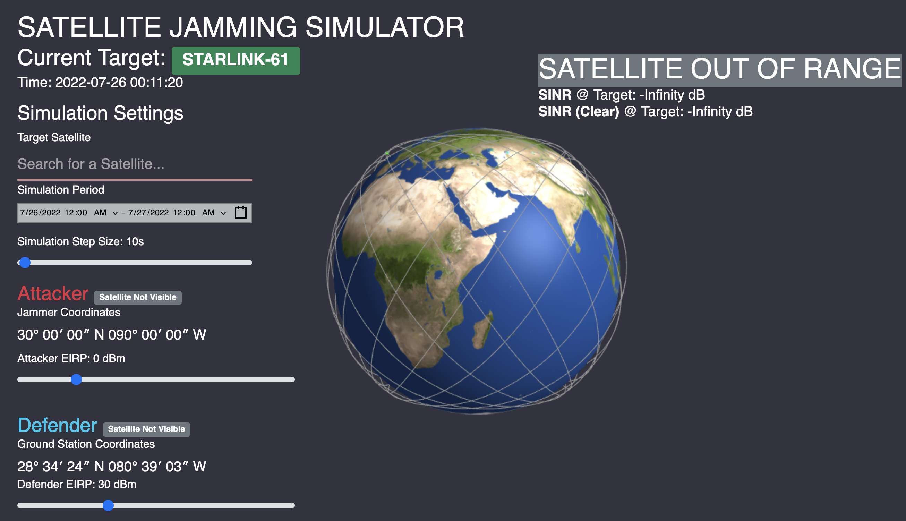

# Space Jam Resources

This repository includes resources and demos from the Defcon 30 Presentation *Space Jam: Exploring Radio Frequency Attacks in Outer Space*.

## Cloning this Repo

This repo uses git submodules. To clone it fully run:
```bash
git clone --recursive https://github.com/deptofdefense/dc30-space-jam
```

# Satellite Jamming Simulator



## About
This is a fork of the excellent [Satellite Tracker](https://github.com/dsuarezv/satellite-tracker) project by David Suarez.

It adds the ability to simulate basic Radio Frequency Interference (RFI) scenarios for satellites in Earth Orbit. It is intended to help users gain a simple intuition of the interaction between orbital motion and radio transmission requirements.

The underlying model is a simple calculation of Free Space Path Loss on the basis of distance between two isotropic antennas: one aboard the spacecraft and the other located on the Earth's surface. Both the jammer and defender are assumed to be operating in the same frequency and no protocol-level implementation is simulated.

Orbits are propagated using recent data from the Celestrak satellite catalog and the SGP4 implementation from [satellite-js](https://github.com/shashwatak/satellite-js) library.

Feel free to modify this for your own learning and projects. Some things you might find fun to try implementing:
* Jamming from one ground-station to another with the satellite as the primary transmitter (e.g. GPS jamming)
* Jamming from one satellite to another
* Jamming in near-band frequencies
* The presence of multiple jammers or transmitters

## Running the App
This is a static client-side javascript implementation. Running it should just be a matter of:
```bash
cd satellite-jamming-simulator/
npm install
npm run start
```

This has been tested with `node v18.4.0`, your mileage may vary with other versions.

## Making Modifications
Most of the relevant physical modeling implementation is contained in `engine.js` or `tle.js`. Most of the UI is implemented directly in `App.js`.

# DVB-S2 Jamming Simulation Flowgraph

This GNU Radio Flowgraph is built around the OOT module `gr-dvbs2rx` (https://github.com/igorauad/gr-dvbs2rx/issues). It allows for the basic end-to-end simulation of two DVB-S2 transmissions combined into a single receiver for demodulation.

To run the flowgraphs, you will need to install the OOT module for gnuradio companion as directed here: https://github.com/igorauad/gr-dvbs2rx/blob/master/docs/installation.md

To interact with the MPEG-TS outputs and inputs, you should check out the excellent `tsduck` toolkit: https://tsduck.io/

Two small transport streams are provided as sample files for testing.
